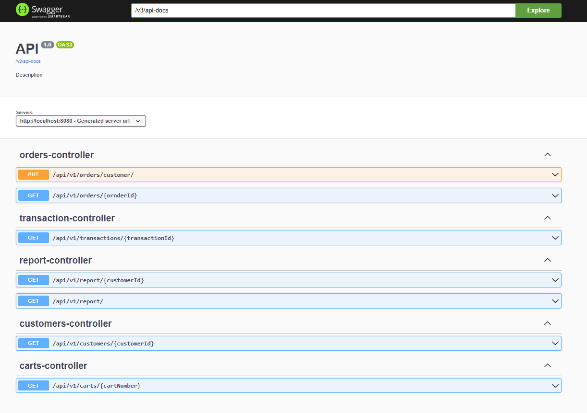
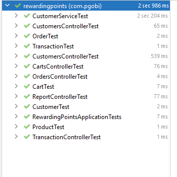
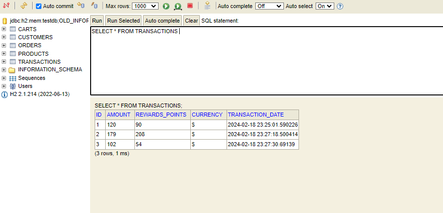
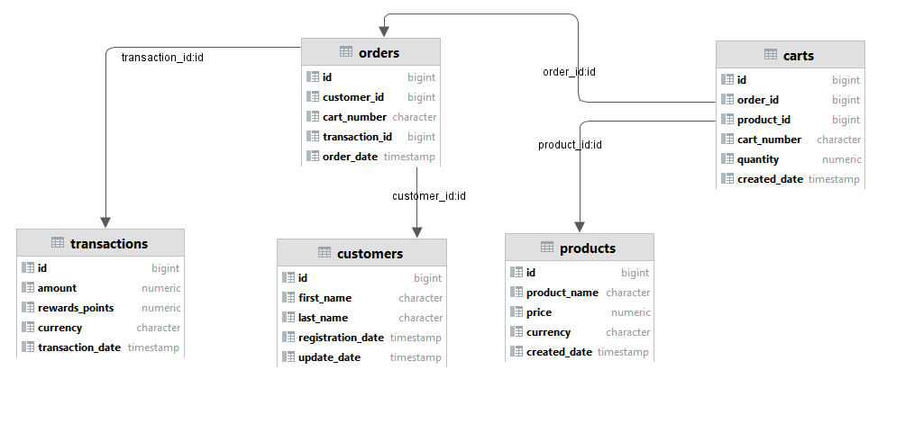

```                                                                                                                                                                            
       *####-                                                                                                                                                                                                          
       *####-      .:-=+++*++=-.      -----.         .----:     .:-=+++*++=-.             
       *####-    =##############*:    =####+         =####-   =##############*:           
       *####-    :#+=-:....:=#####:    #####:        *####    :*+=-:....:=#####.            
       *####-                 ####*     *####=      =####.                 ####*          
       *####-            ...::####*     :#####.     ####*             ...::####*          
       *####-       -+*###########*      +####+    =####:        -+*###########*          
       *####-    .+####*+==---####*      .#####.   ####*      :+####*+==---####*                  
       *####-   +#####-.  :-*#####*         *########.       +#####-. .:=*#####*          
       *####:    +###########*-###*         :#######-         *###########*-###*          
      .#####      .-+**#**=-.  ===-          ======-           .-+*##**=-.  ===-          
      +####=                                                                                                                                               
  .=#####=                                                                                
  .+##*=.                                                                                                                                                                                         
```
### Report Rewards ### 

# Rewarding Points #
version: **1.0  17.02.2024**

Author: **pgobi**

### About ###
A retailer offers a rewards program to its customers, awarding points based on each recorded purchase.

### Tech stack ####
- [java = 17] (
- [maven >= 2.7] 
- [Spring Boot = 2.7.9]
- [Junit5]
- [H2]

### Installing  ####
To see the outputs of the plugin for the current rules and status of the code just run
```
mvn install
```

## API ### 
[Swagger UI]  [http://localhost:8080/swagger-ui/index.html]()



#### [reportResponse-controller]
**URL**: [http://localhost:8080/api/v1/reportResponse/1]()
```
curl -X 'GET' \
  'http://localhost:8080/api/v1/reportResponse/1' \
  -H 'accept: application/json' 
```
```
Response:
[
  {
    "customerId": 1,
    "totalRewards": 90
  }
]
```

**URL**: [http://localhost:8080/api/v1/reportResponse/]()
```
curl -X 'GET' \
  'http://localhost:8080/api/v1/reportResponse/' \
  -H 'accept: application/json' 
```
```
Response:
[
  {
    "customerId": 1,
    "totalRewards": 90
  }
]
```
### [orders-controller]
**URL**:PUT  [http://localhost:8080/api/v1/orders/1]()

```
curl -X 'PUT' \
  'http://localhost:8080/api/v1/orders/1' \
  -H 'accept: */*' \
  -H 'Content-Type: application/json' \
  -d '{
  "productIds": [
    1,2
  ],
  "quantities": [
    2,2
  ]
}'
```
```
Request body:
{
{
  "productIds": [
    1,2
  ],
  "quantities": [
    2,2
  ]
}
}
Response:
{
  "id": 1,
  "cartNumber": "pqrstuvwxyzABCDEFGHIJKLMRSTUVWXYZ01",
  "customerId": 1,
  "transactionId": 1,
  "orderDate": "2024-02-01T00:00:00"
}
 
```
**URL**: GET [http://localhost:8080/api/v1/orders/1]()
```
curl -X 'GET' \
  'http://localhost:8080/api/v1/orders/1' \
  -H 'accept: application/json'
```
```
Response:
{
  "id": 1,
  "cartNumber": "pqrstuvwxyzABCDEFGHIJKLMRSTUVWXYZ01",
  "customerId": 1,
  "transactionId": 1,
  "orderDate": "2024-02-01T00:00:00"
}
```

### [transaction-controller]
**URL**:GET  [http://localhost:8080/api/v1/transactions/1]()
```
curl -X 'GET' \
  'http://localhost:8080/api/v1/transactions/1' \
  -H 'accept: application/json'
```
```
Response:
{
  "id": 1,
  "amount": 120,
  "currency": "$",
  "transactionDate": "2024-02-01T00:00:00",
  "rewardsPoints": 90
}
```

#### [customers-controller]

**URL**:GET  [http://localhost:8080/api/v1/customers/1]()
```
curl -X 'GET' \
  'http://localhost:8080/api/v1/customers/1' \
  -H 'accept: application/json'
```
```
Response:
{
  "id": 1,
  "firstName": "Olivia",
  "lastName": "Boyes",
  "registrationDate": "2024-02-18T17:17:57.124322",
  "updateDate": null
}

```
### [carts-controller]
**URL**: GET [http://localhost:8080/api/v1/carts/pqrstuvwxyzABCDEFGHIJKLMRSTUVWXYZ01]()

```
Request 
curl -X 'GET' \
  'http://localhost:8080/api/v1/carts/pqrstuvwxyzABCDEFGHIJKLMRSTUVWXYZ01' \
  -H 'accept: application/json'
```
```
Response:
[
  {
    "id": 1,
    "productId": 1,
    "quantity": 1,
    "cartNumber": "pqrstuvwxyzABCDEFGHIJKLMRSTUVWXYZ01",
    "orderId": 1,
    "createdDate": "2024-02-18T17:17:57.12532"
  },
  {
    "id": 2,
    "productId": 1,
    "quantity": 2,
    "cartNumber": "pqrstuvwxyzABCDEFGHIJKLMRSTUVWXYZ01",
    "orderId": 2,
    "createdDate": "2024-02-18T17:17:57.12532"
  }
]
```

### Integration test ### 
**URL**:  [./src/test/java/com/pgobi/rewardingpoints/integrationtest]()

### Unit test ###
**URL**:  [./src/test/java/com/pgobi/rewardingpoints/services]()
**URL**:  [./src/test/java/com/pgobi/rewardingpoints/controller]()




### Database ####
[http://localhost:8080/h2-console]()

**URL:** [jdbc:h2:mem:testdb;OLD_INFORMATION_SCHEMA=TRUE;DATABASE_TO_UPPER=false;]()

**User**:sa

**pass**:sa



| Tabele | Description |
|------------|-----------|
| carts | list carts | 
| customers | list customers | 
| orders | list customers | 
| products | list products |
| transactions | list transactions | 



### SQL Exaple ### 

**Init SQL Query :** [./src/main/resources/db]()

Summary points on last 90 days via customer_id
```
SELECT o.customer_id , SUM (t.rewards_points) As totalRewards FROM transactions t INNER JOIN orders o ON o.transaction_id=t.id
WHERE t.transaction_date BETWEEN (CURRENT_DATE()-90) AND CURRENT_DATE() GROUP BY o.customer_id
```